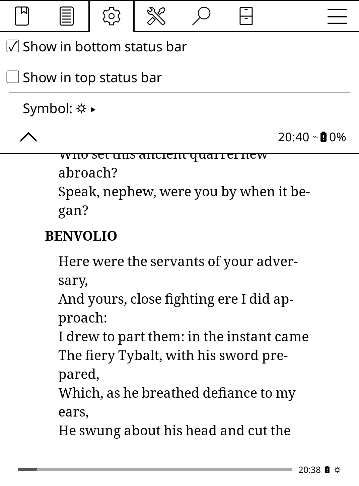
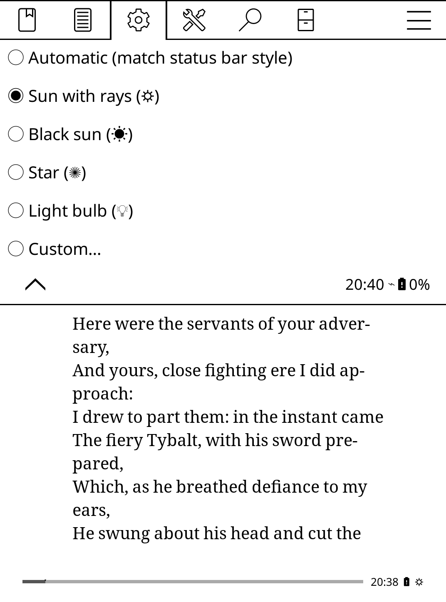

# Front Light Indicator — a KOReader plugin

Shows a small symbol in the [KOReader](https://github.com/koreader/koreader) status bar **while
the front light is on**, and **nothing at all when it is off** — an at-a-glance reminder that the
light is on (and quietly draining your battery).

## Screenshots

<table><tr>
<td align="center" valign="top"><br>Indicator (☼) in the status bar while reading</td>
<td align="center" valign="top"><br>Device ▸ Front light indicator</td>
<td align="center" valign="top"><br>Symbol picker</td>
</tr></table>

## Features

- **Bottom status bar (footer)** — adds the indicator via KOReader's supported external-content
  API. The symbol appears only while the light is on; when it's off, nothing is shown and no space
  is used.
- **Top status bar (header)** — optional, for reflowable documents (EPUB, etc.). PDFs have no top
  status bar, so the option is greyed out there.
- **Symbol picker** — choose the glyph:
  - **Automatic** (default) follows your status bar item style — `☼` (Icons), `✺` (Compact), or
    `L` (Letters). The plain `L` only appears when your status bar uses the Letters style, which
    shows text abbreviations instead of icons.
  - Presets: `☼` `☀` `✺` `💡`.
  - **Custom…** — type any glyph or short text (e.g. `LIGHT`).
- In-app help on every option (long-press a menu row).

Every setting lives under **Device ▸ Front light indicator**. On devices without a front light the
plugin disables itself.

## Installation

The actual plugin is the `frontlightindicator.koplugin/` folder in this repo (the repo root only
holds docs and screenshots). KOReader loads plugins from folders named `*.koplugin`, so copy — or
symlink — that subfolder into your KOReader `plugins/` directory:

```sh
git clone https://github.com/kanni/koreader-frontlight-indicator.git
cp -r koreader-frontlight-indicator/frontlightindicator.koplugin /path/to/koreader/plugins/
# …or symlink it so `git pull` keeps it up to date:
# ln -s "$(pwd)/koreader-frontlight-indicator/frontlightindicator.koplugin" /path/to/koreader/plugins/
```

The `plugins/` location depends on your platform (e.g. `koreader/plugins/` in the app directory,
or a `plugins/` folder under your KOReader home/data directory). Restart KOReader after installing.

## Development

The plugin is two files under [`frontlightindicator.koplugin/`](frontlightindicator.koplugin):
[`_meta.lua`](frontlightindicator.koplugin/_meta.lua) (metadata) and
[`main.lua`](frontlightindicator.koplugin/main.lua) (a `WidgetContainer` subclass). It touches no
KOReader core files — it uses `ReaderFooter:addAdditionalFooterContent` and
`ReaderCoptListener:addAdditionalHeaderContent`.

A quick syntax check without a full KOReader build (requires [LuaJIT](https://luajit.org/)):

```sh
luajit -e "assert(loadfile('frontlightindicator.koplugin/main.lua'))"
```

## License

[AGPL-3.0](LICENSE), matching KOReader.
